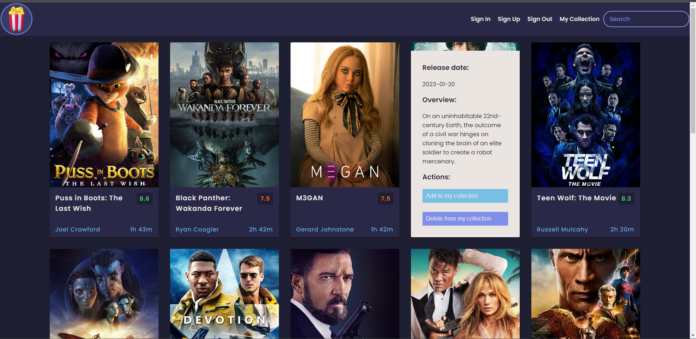
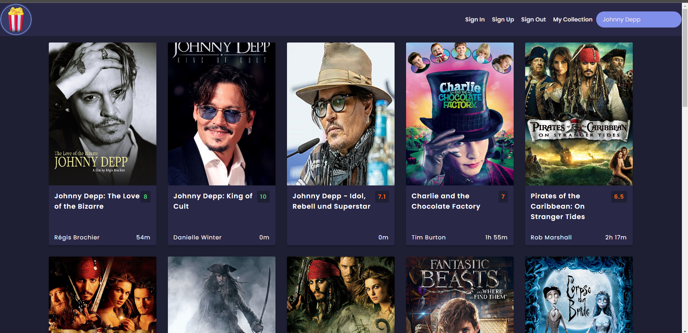
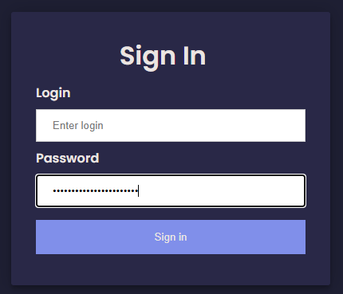
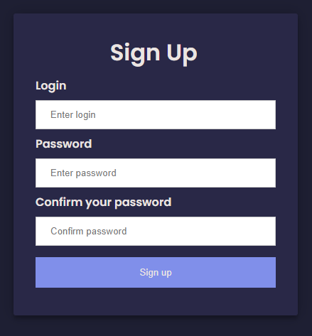
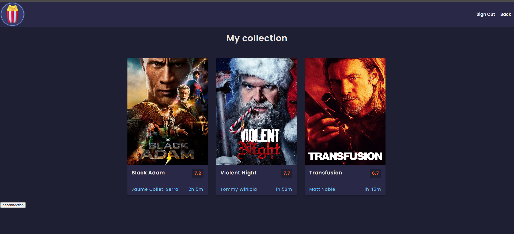

# Find a Movie

## Présentation de l'équipe

- **SORIN** Alexia : développeuse spécialisée dans le frontend
- **MERIC-PONS** Mathis : développeur spécialisé dans le frontend
- **DOSNON** Louis : développeur spécialisé dans le backend
- **GARCIA** Christophe : développeur spécialisé dans le build
- **PERON** Maureen : chef de projet (intervenante ASI)

## Description du projet

**Find a Movie** est une application web en anglais permettant de chercher un film ! Vous n'arrivez pas à vous décider sur le film de ce soir ? Vous êtes en manque d'idée ? Vous voulez chercher un film suivant un acteur ? Trouvez votre film ici grâce à l'API [TMDB](https://www.themoviedb.org/?language=fr) qui fournit une liste très complète de films et de personnes du 7e art.

L'application gère un système d'utilisateurs. Il est possible de s'y connecter et d'ajouter des films à sa collection pour se rappeler de les voir plus tard par exemple. *(fonctionnalité en cours de développement)*

## Présentation de l'application

### Accueil

L'accueil permet de voir une vue des films les plus populaires du moment. Une carte de film est définie par le poster du film, son titre, sa note, son réalisateur et sa durée. En glissant la souris sur chaque carte, une liste déroulante apparaît affichant la date de sortie du film, un court résumé et 2 actions :

- Enregister le film à sa collection
- Supprimer le film de sa collection

Il est ainsi possible de rechercher un film :
- par son nom
- par le nom d'un(e) réalisateur/réalisatrice
- par le nom d'un(e) acteur/actrice

### Sign pages

Une page de connexion (Sign in) et une page d'inscription (Sign up) sont accessibles pour la gestion d'utilisateurs.

### My Collecion

Une page répertorie tous les films sauvegardés par l'utilisateur connecté. Il peut en faire une liste de films déjà vus, de films à voir, ou même de films les plus aimés.

